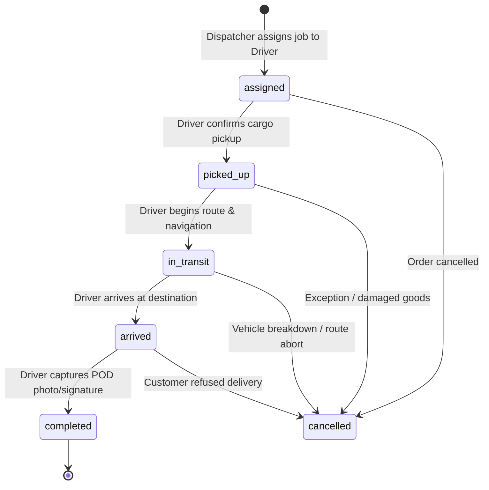

# Member 2 Handoff & Technical Specification 🚚📦
**FleetFlow – Smartphone-Based Fleet & Delivery Management System**
*Author:* Member 2 (Driver & Vehicle UI, Delivery Lifecycle Flow, Component Contracts)  
*Status:* ✅ Completed  
*Incoming Handoff:* From Member 1 (Task 2: App Shell, Auth, Operations Portal)  
*Outgoing Handoff:* To Member 3 (Task 4: Providers, GPS Tracking, Active Shift Telematics)  

---

## 📋 Table of Contents
1. [Executive Summary & Scope](#1-executive-summary--scope)
2. [Driver Screen Sketches & Wireframes](#2-driver-screen-sketches--wireframes)
   - [2.1 Driver Home Screen](#21-driver-home-screen)
   - [2.2 Assigned Jobs Screen](#22-assigned-jobs-screen)
   - [2.3 Delivery Detail Screen](#23-delivery-detail-screen)
   - [2.4 Shift Summary Screen](#24-shift-summary-screen)
3. [Delivery Lifecycle Flow Specification](#3-delivery-lifecycle-flow-specification)
   - [3.1 State Progression Sequence](#31-state-progression-sequence)
   - [3.2 State Transition Matrix & Rules](#32-state-transition-matrix--rules)
   - [3.3 Firestore Schema Alignment](#33-firestore-schema-alignment)
4. [Agreed Component Insertion Points (Members 3–5)](#4-agreed-component-insertion-points-members-35)
   - [4.1 Map & Live GPS Insertion Point (Member 5 & Member 3)](#41-map--live-gps-insertion-point-member-5--member-3)
   - [4.2 Camera & Proof-of-Delivery Insertion Point (Member 5)](#42-camera--proof-of-delivery-insertion-point-member-5)
   - [4.3 Safety & Telematics Insertion Point (Member 3 & Member 5)](#43-safety--telematics-insertion-point-member-3--member-5)
5. [Driver & Vehicle CRUD Integration](#5-driver--vehicle-crud-integration)
6. [Work Evidence & Review Notes](#6-work-evidence--review-notes)
7. [Checklist for Member 3 (Task 4 Handoff)](#7-checklist-for-member-3-task-4-handoff)

---

## 1. Executive Summary & Scope

Member 2 was tasked with establishing the complete driver experience for FleetFlow following the completion of Task 2 by Member 1. This delivery fulfills all core requirements:

1. **Screen Architectures & Layouts:** Built `DriverHomeScreen`, `AssignedJobsScreen`, `DeliveryDetailScreen`, and `ShiftSummaryScreen` with clean Material 3 design and reactive state bindings.
2. **Delivery Status Progression:** Formally specified and implemented the linear delivery lifecycle:
   $$\text{assigned} \longrightarrow \text{picked\_up} \longrightarrow \text{in\_transit} \longrightarrow \text{arrived} \longrightarrow \text{completed}$$
   Enforced strict validation forbidding invalid state leaps (e.g., jumping directly from `assigned` to `completed`).
3. **Agreed Insertion Points for Members 3–5:** Established decoupled, production-ready interface widgets with parameter contracts for:
   - **Map & GPS Tracking** (`MapInsertionPoint`)
   - **Camera & Proof of Delivery** (`CameraPodInsertionPoint`)
   - **Safety Telematics & SOS Alerting** (`SafetyTelematicsInsertionPoint` & `SafetyBannerWidget`)
4. **Driver State Management:** Implemented `DriverProvider` managing shift active state, assigned delivery lists, status progression, and proof-of-delivery attachments.
5. **Driver & Vehicle CRUD:** Added functional interactive modal creation dialogs in `AdminDashboardScreen`.

---

## 2. Driver Screen Sketches & Wireframes

### 2.1 Driver Home Screen (`lib/screens/driver/driver_home_screen.dart`)

```text
+-------------------------------------------------------------+
| FleetFlow Driver Portal            [● ON DUTY]  [Logout 🚪] |
| Vehicle: Ford Transit 350 (FLT-882-CA)                      |
+-------------------------------------------------------------+
| [⏱ Active Shift in Progress | Elapsed: 3h 25m] [Shift Summary]|
+-------------------------------------------------------------+
| 🛡 [Telematics Active: Safe Driving Mode (98/100)           ]|
+-------------------------------------------------------------+
| [ACTIVE JOB HERO CARD]                                      |
|  DEL-2041 • URGENT                       [Status: IN TRANSIT]|
|  Apex Health Logistics                                      |
|  📍 742 Evergreen Terrace, Sector 4, Springfield            |
|  📦 2x Temperature-Controlled Medical Cases                 |
|  [ >>> Continue Delivery (In Transit) >>> ]                 |
+-------------------------------------------------------------+
| Today's Metrics:                                            |
| [Assigned: 4]   [In Progress: 1]   [Completed: 1]           |
+-------------------------------------------------------------+
| Quick Actions:                                              |
| [ 📋 All Jobs (4) ]            [ 📊 Shift Summary ]         |
+-------------------------------------------------------------+
| Assigned Jobs Today                             [View All >]|
| • DEL-2041  Apex Health Logistics             [IN TRANSIT]  |
| • DEL-2042  Metro Tech Hub (Reception)        [ASSIGNED]    |
| • DEL-2043  Bay Coffee Roasters               [ASSIGNED]    |
+-------------------------------------------------------------+
|                                    (FAB: Jobs List [4])     |
+-------------------------------------------------------------+
```

### 2.2 Assigned Jobs Screen (`lib/screens/driver/assigned_jobs_screen.dart`)

```text
+-------------------------------------------------------------+
| <- Assigned Jobs                                            |
| [🔍 Search by ID, recipient, or address...                ] |
+-------------------------------------------------------------+
| [All (4)]  [Active (1)]  [Pending (2)]  [Completed (1)]     |
+-------------------------------------------------------------+
| +---------------------------------------------------------+ |
| | DEL-2041  [URGENT]                 [Status: IN TRANSIT] | |
| | Apex Health Logistics                                   | |
| | 📍 742 Evergreen Terrace, Sector 4, Springfield         | |
| | 📦 2x Temperature-Controlled Medical Cases              | |
| | ------------------------------------------------------- | |
| | Step 3 of 5                       [View Details & Flow >| |
| +---------------------------------------------------------+ |
| +---------------------------------------------------------+ |
| | DEL-2042                           [Status: ASSIGNED]   | |
| | Metro Tech Hub (Reception)                              | |
| | 📍 100 Market St, Suite 500, San Francisco, CA          | |
| | 📦 1x IT Server Equipment & Cables                      | |
| | ------------------------------------------------------- | |
| | Step 1 of 5                       [View Details & Flow >| |
| +---------------------------------------------------------+ |
+-------------------------------------------------------------+
```

### 2.3 Delivery Detail Screen (`lib/screens/driver/delivery_detail_screen.dart`)

```text
+-------------------------------------------------------------+
| <- DEL-2041                                      [Call 📞]  |
+-------------------------------------------------------------+
| [DELIVERY LIFECYCLE FLOW]                   [Step 3 of 5]   |
| (1:Assigned) === (2:PickedUp) === (3:InTransit) --- (4:Arrived) --- (5:Done) |
+-------------------------------------------------------------+
| [AGREED MAP INSERTION POINT (Member 5 Map / Member 3 GPS)]  |
| +---------------------------------------------------------+ |
| | 🗺️ [Map View Canvas: Route Polyline & Destination Pin]   | |
| | Dest: 742 Evergreen Terrace                             | |
| | [GPS: 37.7833, -122.4167]     [Recenter] [External Map] | |
| +---------------------------------------------------------+ |
+-------------------------------------------------------------+
| Recipient & Package Details:                                |
| 👤 Apex Health Logistics • 📞 +1 (415) 892-1100              |
| 📍 742 Evergreen Terrace, Sector 4, Springfield             |
| 📦 2x Temperature-Controlled Medical Cases                  |
| ℹ️ Ring bell at Gate 2. Cold storage signature required.     |
+-------------------------------------------------------------+
| [AGREED SAFETY TELEMATICS INSERTION POINT (Member 3 & 5)]   |
| [ Live Speed: 46 km/h (Limit: 50) ]  [ Safety Score: 97% ]  |
| [ 🚨 Safety / Roadside Assistance (SOS) ]                   |
+-------------------------------------------------------------+
| [AGREED CAMERA & POD INSERTION POINT (Member 5)]            |
| [ 📷 Tap to Capture Delivery Photo (POD) ]                  |
| [ Received By: _________________________________________ ]  |
| [ Delivery Notes: ______________________________________ ]  |
+-------------------------------------------------------------+
| =========================================================== |
| [STICKY BOTTOM BUTTON: Mark Arrived at Destination      >>] |
+-------------------------------------------------------------+
```

### 2.4 Shift Summary Screen (`lib/screens/driver/shift_summary_screen.dart`)

```text
+-------------------------------------------------------------+
| <- Shift Summary & Report                                   |
+-------------------------------------------------------------+
| [ACTIVE SHIFT]                              [FLT-882-CA]    |
| 03h 25m                                                     |
| Started at 08:30 • Ford Transit 350 High Roof               |
+-------------------------------------------------------------+
| Delivery Performance:                                       |
| [███████████████-------------------------] 25% Completed    |
| 1 of 4 Delivered                                            |
| [Assigned: 4]  [In Progress: 1]  [Completed: 1] [Pending: 2]|
+-------------------------------------------------------------+
| Telematics Safety Scorecard (Member 3 Sensors / Member 5 UI)|
| [ Driving Score: 98/100 (Excellent) ]  [ Harsh Events: 0 ]  |
+-------------------------------------------------------------+
| [ 🛑 End Shift & Clock Out ]                                |
| [ Return to Active Deliveries ]                             |
+-------------------------------------------------------------+
```

---

## 3. Delivery Lifecycle Flow Specification

### 3.1 State Progression Sequence

Deliveries must strictly advance through the following sequential states:



### 3.2 State Transition Matrix & Rules

| Current Status | Target Status | Permitted? | Trigger Action / Validation Precondition |
|:---|:---|:---:|:---|
| `assigned` | `picked_up` | ✅ Yes | Driver accepts parcel at hub/warehouse. |
| `picked_up` | `in_transit` | ✅ Yes | Driver begins driving; triggers Member 3 GPS tracking. |
| `in_transit` | `arrived` | ✅ Yes | Driver reaches recipient location geofence. |
| `arrived` | `completed` | ✅ Yes | Requires Proof of Delivery photo & signature note. |
| `assigned` | `in_transit` | ❌ No | **Invalid state jump.** Must confirm pickup first. |
| `assigned` | `completed` | ❌ No | **Invalid state jump.** |
| `in_transit` | `picked_up` | ❌ No | **Cannot move backwards.** |
| `completed` | Any state | ❌ No | **Terminal state.** No further changes permitted. |
| Any (non-terminal) | `cancelled` | ✅ Yes | Permitted with dispatcher authorization. |

Implemented in `lib/models/delivery.dart`:
```dart
static bool isValidTransition(String current, String target) {
  if (current == target) return false;
  if (current == completed || current == cancelled) return false;
  if (target == cancelled) return true;

  final currentIndex = standardSequence.indexOf(current);
  final targetIndex = standardSequence.indexOf(target);

  return currentIndex != -1 && targetIndex == currentIndex + 1;
}
```

### 3.3 Firestore Schema Alignment

Cloud Firestore collection `deliveries/`:

```json
{
  "id": "DEL-2041",
  "driverId": "drv_01",
  "vehicleId": "FLT-882-CA",
  "recipientName": "Apex Health Logistics",
  "recipientPhone": "+1 (415) 892-1100",
  "address": "742 Evergreen Terrace, Sector 4, Springfield",
  "latitude": 37.7833,
  "longitude": -122.4167,
  "packageDescription": "2x Temperature-Controlled Medical Cases",
  "specialInstructions": "Ring bell at Gate 2. Cold storage signature required.",
  "priority": "urgent",
  "status": "in_transit",
  "proofPhotoUrl": "https://storage.googleapis.com/fleetflow-dev/pod/DEL-2041_pod.jpg",
  "signatureNotes": "Delivered to warehouse reception.",
  "createdAt": "2026-09-30T10:00:00Z",
  "pickedUpAt": "2026-09-30T10:45:00Z",
  "inTransitAt": "2026-09-30T11:20:00Z",
  "arrivedAt": null,
  "completedAt": null
}
```

---

## 4. Agreed Component Insertion Points (Members 3–5)

To prevent merge conflicts and maintain clean separation of concerns, Member 2 has created three dedicated insertion point components with agreed parameters.

### 4.1 Map & Live GPS Insertion Point (Member 5 & Member 3)
*File:* `lib/widgets/driver/map_insertion_point.dart`  
*Owners:* Member 5 (Map visualization & polyline rendering) & Member 3 (GPS tracking stream)

```dart
class MapInsertionPoint extends StatelessWidget {
  final double destinationLat;
  final double destinationLng;
  final String destinationAddress;
  final double? currentDriverLat;      // Feed from Member 3 GPS stream
  final double? currentDriverLng;      // Feed from Member 3 GPS stream
  final bool isNavigationActive;       // Set true when in_transit
  final VoidCallback? onStartNavigation;
  final VoidCallback? onRecenter;
  final VoidCallback? onOpenExternalMap;
  final double height;
  ...
}
```

**How Member 3 & 5 plug in:**
- Member 3 connects `LocationProvider.currentLocation` to `currentDriverLat` and `currentDriverLng`.
- Member 5 replaces the `_MapGridPainter` with the live Google Maps / Mapbox `GoogleMap` widget and polyline route points.

---

### 4.2 Camera & Proof-of-Delivery Insertion Point (Member 5)
*File:* `lib/widgets/driver/camera_pod_insertion_point.dart`  
*Owner:* Member 5 (Screens + Camera Capture + Firebase Storage)

```dart
class CameraPodInsertionPoint extends StatefulWidget {
  final String deliveryId;
  final String? initialPhotoUrl;
  final String? initialNotes;
  final ValueChanged<String>? onPhotoCaptured;
  final void Function(String recipientName, String notes)? onDetailsSubmitted;
  final bool isRequired;
  ...
}
```

**How Member 5 plugs in:**
- Replace `_simulatePhotoCapture()` with `ImagePicker().pickImage(source: ImageSource.camera)`.
- Upload image file to Firebase Storage under `pod/${deliveryId}.jpg`.
- Return public download URL to `onPhotoCaptured(downloadUrl)`.

---

### 4.3 Safety & Telematics Insertion Point (Member 3 & Member 5)
*File:* `lib/widgets/driver/safety_telematics_insertion_point.dart`  
*Owners:* Member 3 (Accelerometer & Speed Telematics Provider) & Member 5 (Push Notifications & Alert UI)

```dart
class SafetyTelematicsInsertionPoint extends StatelessWidget {
  final double currentSpeedKmh;        // Feed from Member 3 GPS speed
  final double speedLimitKmh;          // Provided by map / road API
  final int safetyScore;               // Feed from Member 3 telematics algorithm
  final int harshBrakingCount;         // Feed from Member 3 accelerometer events
  final VoidCallback? onEmergencySosPressed;
  ...
}

class SafetyBannerWidget extends StatelessWidget {
  final int safetyScore;
  final bool isSafe;
  ...
}
```

**How Member 3 & 5 plug in:**
- Member 3 binds gyroscope/accelerometer streams to track harsh braking events.
- Member 5 handles the `onEmergencySosPressed` callback to send a high-priority FCM emergency push notification to the dispatcher.

---

## 5. Driver & Vehicle CRUD Integration

In addition to driver screens, Member 2 completed the CRUD creation dialogs inside `AdminDashboardScreen` (`lib/screens/admin/admin_dashboard_screen.dart`):
1. **Add Driver Dialog:** Captures Driver Full Name, Email Address, Assigned Fleet Vehicle, and Duty Status ('On Shift' / 'Off Duty') with input validation.
2. **Add Vehicle Dialog:** Captures Vehicle Model, License Plate, and Operational Status ('available' / 'in-use' / 'maintenance') with input validation.
3. Updated the driver and vehicle tab lists to be reactive and stateful.

---

## 6. Work Evidence & Review Notes

### Code Modifications Summary

| File | Status | Description |
|:---|:---:|:---|
| `lib/models/delivery.dart` | **Updated** | Added `DeliveryStatus` state machine, validation methods (`canTransitionTo`), Firestore serialization, and coordinate fields. |
| `lib/models/vehicle.dart` | **Updated** | Added `VehicleStatus`, serialization (`fromMap`/`toMap`), and odometer telemetry. |
| `lib/providers/driver_provider.dart` | **New** | State management for driver active shift, delivery filtering, status advancement, and POD capture. |
| `lib/screens/driver/driver_home_screen.dart` | **New** | Driver portal home screen with shift banner, telematics pill, active job hero, and metrics. |
| `lib/screens/driver/assigned_jobs_screen.dart` | **New** | Tabbed job list with search and filter chips (`all`, `active`, `pending`, `completed`). |
| `lib/screens/driver/delivery_detail_screen.dart` | **New** | 5-step delivery lifecycle stepper, integrated map, camera POD, and safety insertion points. |
| `lib/screens/driver/shift_summary_screen.dart` | **New** | Shift duration, performance scorecard, telematics report, and end-shift clock-out. |
| `lib/widgets/driver/map_insertion_point.dart` | **New** | Contract component for Member 5 Map & Member 3 GPS tracking. |
| `lib/widgets/driver/camera_pod_insertion_point.dart` | **New** | Contract component for Member 5 POD camera capture & Firebase Storage upload. |
| `lib/widgets/driver/safety_telematics_insertion_point.dart` | **New** | Contract component for Member 3 telematics & Member 5 safety alerts/SOS. |
| `lib/screens/admin/admin_dashboard_screen.dart` | **Updated** | Wired interactive Add Driver and Add Vehicle modal forms for Member 2 CRUD responsibility. |
| `lib/main.dart` | **Updated** | Bound `DriverProvider`, registered driver routes, and wired auth gate to `DriverHomeScreen`. |
| `lib/screens/home_screen.dart` | **Updated** | Forwards to `DriverHomeScreen` maintaining backward compatibility. |
| `test/driver_flow_test.dart` | **New** | Comprehensive unit & widget tests verifying status flow, provider state, and UI screens. |
| `docs/HANDOFF_MEMBER2_TO_MEMBER3.md` | **New** | Complete architecture, wireframes, and handoff documentation. |

---

## 7. Checklist for Member 3 (Task 4 Handoff)

Member 3 is responsible for **Task 4: State management, GPS/trip providers, active-shift tracking**.

### Recommended Action Steps for Member 3:
1. **Branch Out:** Checkout from `main` or `feature/member2-driver-flow`:
   ```bash
   git checkout -b feature/member3-providers-tracking
   ```
2. **Implement `TripProvider` / `LocationProvider`:**
   - Create `lib/providers/trip_provider.dart`.
   - Wire GPS location polling/stream (`geolocator` package) during active shifts.
3. **Bind GPS stream to `MapInsertionPoint`:**
   - Pass `currentDriverLat` and `currentDriverLng` from `LocationProvider` into `DeliveryDetailScreen` and `MapInsertionPoint`.
4. **Wire Telematics Sensor Stream to `SafetyTelematicsInsertionPoint`:**
   - Detect speed limits vs current speed.
   - Bind `sensors_plus` (accelerometer) to count harsh braking events.
5. **Persist Trips to Firestore `trips/`:**
   - Record `startTime`, `endTime`, `distanceKm`, and route points.

---
*FleetFlow Team — Mobile Application Development*
